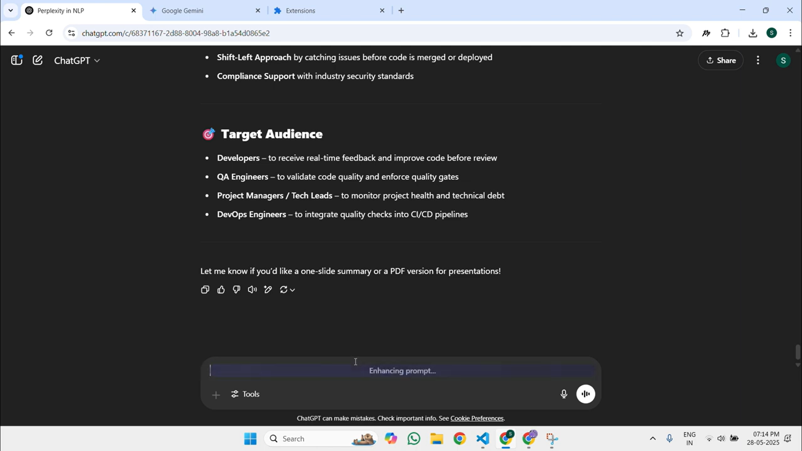
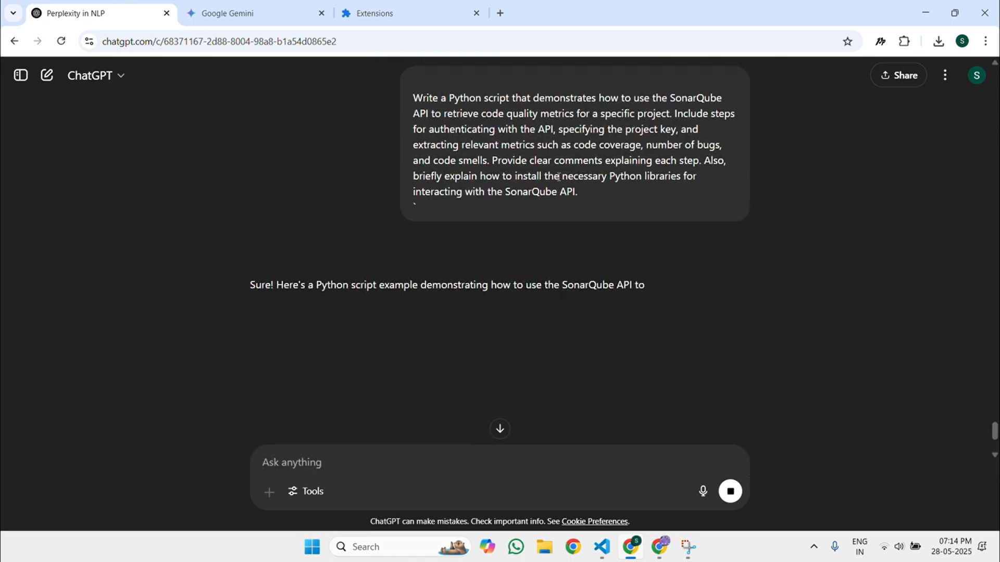

# Promper - AI Prompt Enhancement Extension

## Overview
Promper is a Chrome extension that automatically enhances your prompts across various AI chat interfaces including ChatGPT, Google Gemini, and Claude. This extension intelligently analyzes your conversation context and transforms your queries into more effective prompts, helping you get better responses with less back-and-forth.

## Demo Video 
https://www.youtube.com/watch?v=VM2K-JvrVXs

## Features

- **One-Click Enhancement**: Press `Ctrl + Shift` while typing to instantly enhance your prompt before sending
- **Context-Aware**: Analyzes your previous conversation to create more relevant and personalized prompts
- **Universal Compatibility**: Works seamlessly with multiple AI platforms:
  - OpenAI ChatGPT
  - Google Gemini
  - Anthropic Claude
- **Zero Configuration**: Works out of the box with no setup required
- **Privacy Focused**: Your conversations are processed securely and not stored

## Flow Chart Architecture 

## How It Works

1. Promper reads your current conversation context (previous messages)
2. When you press `Ctrl + Shift`, your draft message is sent to Perplexity's Sonar AI
3. Sonar analyzes your conversation history and current query
4. Your query is automatically rewritten into a more effective prompt
5. The enhanced prompt replaces your original text and can be sent immediately

## Screenshots

## Installation

1. Star & Clone this repo into your local machine.
2. Open chrome://extensions/ , and click Developer Mode.
3. Click Load unpacked & import the folder in which these code files downloaded .

## Benefits

- **Save Time**: Get better responses on your first try
- **Improved Clarity**: Automatically restructures vague questions into clear, specific requests
- **Technical Precision**: Ensures your prompts contain the right details and specifications
- **Learning Tool**: Observe how your prompts are enhanced to improve your own prompt engineering skills

## Technical Details

Promper uses a combination of:
- Content script injection for seamless integration with AI interfaces
- MutationObserver for reliable persistence across dynamic page changes
- Perplexity's Sonar API for state-of-the-art prompt enhancement
- Background script for cross-tab communication and persistent functionality

## Upcoming Features

- Custom enhancement styles (academic, technical, creative)
- User-configurable API keys for those who prefer their own Perplexity account
- Keyboard shortcut customization
- Support for additional AI platforms

## Privacy & Data Usage

Promper only processes the text in your current conversation when you explicitly trigger enhancement with the keyboard shortcut. No conversation data is stored beyond what's necessary for the immediate enhancement. All API communication is secured with industry-standard encryption.

---

Made with ❤️ for better AI interactions
